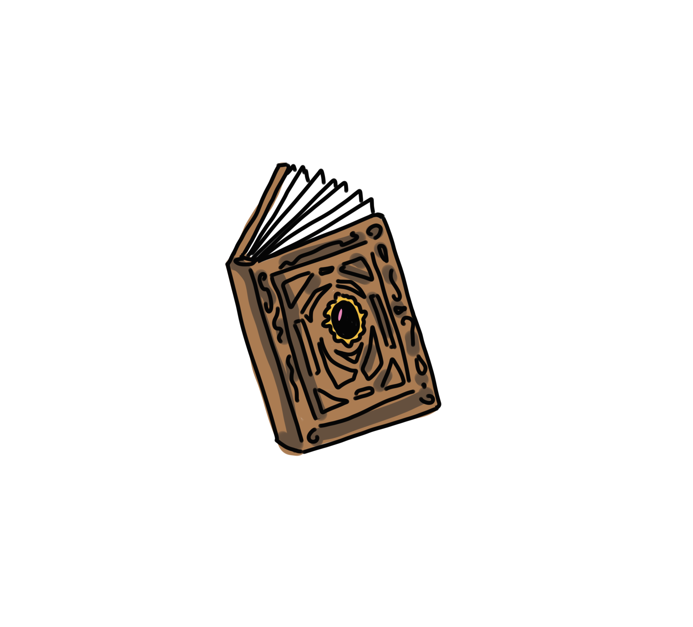

# GCD - Skydom

Eva - Paul - Tanguy - Sarah - Maxence

## Histoire

### L’équipe Confrery Studios

Confrery Studios est une équipe de cinq étudiants : Sarah, Eva et Paul en infographie 3D,  Maxence et Tanguy en Level Design. Sarah est spécialisée dans le character design des monstres et créatures, Eva dans le character design du personnage principal et des PNJ et Paul dans l'environnement et l’architecture.

### Fiche descriptive

- Titre : “Sykdom”
- Elevator pitch : (Résume en quelques mots le concept du jeu.)
- Genre : Aventure / Exploration
- Nombre de joueurs : Solo, PVE
- Public visé : Casual Gamers/ Public Familial
- Plateforme cible : Multi-Plateforme
- Marché cible : Europe/US
- Technologies : Unreal Engine
- Unique Selling Points : Hybridité du Système de Souillure/Point de vie. Gameplay, dynamique en temps réel - Tout public - Monde Évolutif 

## Le jeu

### Backstory

En quête d'énergie infinie pour leur royaume, deux alchimistes réputés créent par mégarde une forme de souillure et provoquent la contagion de leur monde. Ne pouvant le sauver et dans l’urgence, menacés de disparaître dans la corruption, ils découvrent un moyen de quitter leur royaume pour rejoindre un autre univers. Emportant leur nouveau-né, les deux savants sont malheureusement touchés par la souillure et achevés par l’instabilité de leur moyen de fuite, laissant Tim dans le nouveau monde, préservé. Né dans le monde souillé, il est pourtant adopté par une famille reconnue qui observait le phénomène. En conséquence de l’expérience des alchimistes, le passage ne se referma jamais, obligeant les habitants du nouveau monde à confiner le passage, construisant une structure autour. Cependant, le temps passe et la souillure commence à se déverser tout doucement dans le monde saint. L’autre monde tente de traverser le passage et de le fermer. Échouant dans leur quête, ils préparent et envoient Tim, étant le seul capable de traverser le passage. Malheureusement trop âgé, le Tim originel perd sa vitalité et meurt en arrivant dans le monde souillé. La famille du monde saint décide alors d'utiliser la science pour créer des copies de Tim, envoyant un à un les clones sans le leur faire savoir, afin qu'ils achèvent leur mission. A Chaque mort, un nouveau Tim est envoyé.

### Synopsis

Tim Syke est envoyé par ses parents dans le laboratoire du village pour y passer un examen obligatoire. De là, il se retrouve littéralement projeté dans un autre monde ou une souillure contagieuse se répand inexorablement, l'affaiblissant durant toute la durée de son voyage. De l’autre côté, le Mal se répand sans que Tim ne puisse repartir. Il est alors plongé dans l’aventure de sa vie ou il doit apprendre à combattre et à absorber la souillure pour survivre et trouver un moyen de repartir chez lui. Cependant, à chaque mort, aussi nombreuses soient-elles, il réapparaît sans souvenir ni équipement au portail d’arrivée.

### Les intentions

Sykdom est une aventure onirique, cartoon et fantastique à travers un monde ravagé par la corruption. L’architecture globale des infrastructures est inspirée du moyen-âge européen. Dans Sykdom, nous pouvons distinguer deux phases : lorsque Tim nettoie et purge cette souillure, puis lorsque cette dernière s’est volatilisée. 
Dans cette première phase, le gameplay se doit d’être stimulant et dynamique dans une ambiance presque angoissante et oppressante. Tim sera entouré de créatures dangereuses, souillées, et n’aura pas d’autre choix que de se battre ou se défendre, à défaut de fuir. Tandis que la musique s'accélère et oppresse d’autant plus le joueur, l’ambiance visuelle s’assombrit et devient moins féérique. En globalité, la souillure doit être représentée par un violet noirci.
Une fois les différentes zones purifiées, le joueur entrera dans une phase plus paisible : il devra explorer le monde, résoudre des énigmes et se faire des relations. L’ambiance visuelle sera bien plus solaire avec des couleurs douces et chaleureuses. La musique sera plus mélodieuse, moins rythmée et moins oppressante. Le joueur doit vraiment se sentir libre de prendre son temps et de progresser à son rythme.

## Les 3C

### Camera

- Vue à la troisième personne qui permet au joueur d’avoir une vision globale sur un environnement riche et sur ses dangers imminents qui permettent une réaction réaliste de la part du joueur. La caméra suit ses mouvements et lui permet donc une immersion plus complète ainsi qu’une exploration à 180°. Mélange de 2D et 3D entre personnages, décors et items.

### Character

- Tim est un personnage humanoïde, un garçon adolescent représentant l’aventure, le courage, la fragilité et l’innocence. Il est de taille moyenne, est curieux et téméraire malgré son ignorance et sa simplicité. Il possède des cheveux clairs, des tâches de rousseurs, des vêtements légers et pratiques de par sa condition sociale et physique. Il porte également un pendentif représentant au joueur son énergie vitale. Chacuns de ses “clones” est une copie parfaite de Tim.

### Controller
-  Axé sur Souris/Clavier/Manette Mouvements (droite, gauche, avancer, reculer),Saut, Esquive, Frappe, Capacité, Interagir, Paramètres & Collection, Carte
- Touches personnalisables

## Gameplay

### Core Gameplay

**Pillars :  Aventure,Temps Réel, Immersif**

Le joueur disposera d’une interface permettant d’accéder au Journal où ce dernier pourra voir les indices et les éléments narratifs récoltés tout au long de son aventure (objets de quête). Il verra également la Carte du monde (Des environs, à débloquer par exploration progressive à l’image de Baldur’s Gate), ainsi que son niveau de point de vie à travers le visuel du Collier de pierre. Une case “Potion” permettra de le soigner une à deux fois de manière à remonter ses PVs. Une barre de Souillure viendra notifier le joueur de sa progression dans le monde, monde qui évoluera sous forme de paliers.

Le Principe d’Ancien (Arbre sacré) donne au joueur l’accès au système de Sauvegarde, de Repos et de choix d'Équipe/Capacité Passive, d'amélioration d’armes mais aussi la téléportation qui donne accès aux différents paliers. Il s’agira d’une safe zone ou l’on pourra interagir avec les divers éléments pour choisir ce que l’on y fait.
 → Débloquer l’Ancien vient en purifiant chaque zone par le biais de défis annexes.

Le Joueur pourra utiliser plusieurs types d’armes, qu’il aura en permanence sur lui et disponible par le biais d’une roue crantée (Grand Theft Auto, Legend of Zelda). Il disposera de trois types d’armes : Corps à Corps (Épée, Hache, Marteau) / Distance (Bolas, Arc, Bâton Magique) et Outils (Piège, Trappe, Torche, Objets uniques).

Il disposera dans chaque paliers d’une capacité passive unique permettant d’accéder aux différents niveau ou de prendre l’ascendant sur une situation (Double Saut, Passage dans les murs, Protection, Crochetage, Dressage, Nage, Lévitation, Regain de PV, Gain d’Attaque, Gain de PV, Vélocité améliorée. Le stockage de capacités au début du jeu est limité à un puis évolue durant la progression de l’histoire (Quatre capacités passives MAX en fin de jeu)

Les ennemis et PNJ seront dissociables à l’aide d’une surbrillance blanche (Allié) et noire (Ennemi) selon la zone. Ils auront un type entre (Marin, Terrestre, Esprit, Aérien).

Le joueur pourra interagir avec le PNJ allié ou ennemi en cliquant, interagissant avec la touche (selon la plateforme), l’attaquant ou discutant avec lui. Le Clic, ciblage par pression de touche, permet également d’ouvrir, fermer les portes, trappes, d'interagir avec un décor adaptables (faire tomber des arbres, les éboulis, couper les toiles d’araignées etc etc.)

Les niveaux de jeu sont délimités par une frontière physique (arbres, pierre, labyrinthe, remparts) mais que l’on peut parcourir librement (Aller et venir librement). Ils disposent d’une DA propre à leurs environnements (Cavernes des Profondeurs, Jungle marécageuse, Forêt, Désert, Village, Ruines.) On peut s’y battre, interagir avec l’environnement (être piégé, enseveli), y accomplir des défis annexes offrant des “buffs” temporaires/de palier, débloquer les armes. Une zone Libérée de la Corruption offre plus de choix et l’arrivée de nouveaux personnages (à recruter ou qui offrent des types d’armes et d’outils utiles) Certains ennemis souillés et d’autres purifiés (mais toujours belliqueux) subsistent comme un reliquat et de nouveaux défis annexes apparaissent pour maintenir une dynamique de jeu. Elles disposent donc d’une version souillée (Violet-noir) et d’une version purifiée, naturelle.

### Conditions de victoire et de défaite

#### Conditions de victoire :
Nettoyer la Corruption
Découvrir la vérité sur sa vie

#### Conditions de défaite :
Mort du joueur
La souillure envahit la carte

### Gameplays secondaires
Le Gameplay secondaire apporte le système de quête (simpliste) qui permet d’établir divers autres mécaniques secondaires
NB : Il n’existe pas d’inventaire. Les armes et outils sont disponibles par la roue crantée et les objets “récoltés” apparaissent dans le journal :
“Vous avez récolté la Pomme de Jean et devez la lui rapporter”.
L’objet n’étant pas utilisable, il n’est pas Item

### Les quêtes apportent :
- Recrutement d’alliés qui disposent d’une capacité passive unique et non changeable, d’un type d’arme et d’une jauge de vie basée sur celle du joueur, des petits colliers. S’ils meurent, ils sont renvoyés dans l’Arbre
- Système de confiance permettant de rendre les pnj plus ou moins pacifiques et qui offrent des améliorations et du nouveau contenu (Capacités Passives, armes) Le système fonctionnait en parallèle du système de souillure avec des objectifs annexes (nettoyage de monstres, récupération d’item, réparations etc, enigmes..)
- Système d’amélioration qui fait évoluer le type d’arme. Une fois l’arme obtenue, il n’est plus possible d’en gagner une autre mais on peut l’améliorer. Il n’existe pas de différents items d’épée mais d’un unique qui peut évoluer en remplissant les quêtes, en éliminant un boss ou en gagnant la confiance adverse

Exemple de Quête et d’Objectifs Annexes :
- Dans le château, ramener le troupeau de mouton au village
- Détruire des arbres pour offrir des planches et réparer le village
- Tuer cinquante chauve-souris purifiées
- Retrouver Lola

## Mockups

